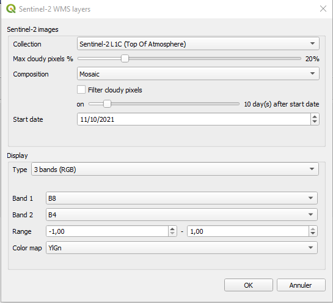

# Sentinel-2 WMS layers for QGis

This QGis plugin enables users to add WMS layers with Sentinel-2 images using the capabilites offered by Google Earth Engine.



## Prerequisites

This plugin uses the python Google Earth Engine API: `earthengine-api` python package. To use it, you need to follow these steps.

First, if you did not sign-up for Google Earth Engine, do it [here](https://earthengine.google.com/signup/)

Then install `earthengine-api` in the QGis python environment.

1. Open an OSGeo4W Shell
2. Type the following commands:

```bash
py3_env
pip install earthengine-api --use-feature=2020-resolver
```

Finally, create an authentication token for Google Earth Engine.

1. Open an OSGeo4W Shell
2. Type the following commands:

```bash
py3_env
python
```

You will get an interactive python console. Execute the two lines of python code:

```python
import ee
ee.Authenticate()
```

This should open a web navigator that asks you to connect to your Google account and
then asks you to accept that the Google Earth Engine Authenticator gets access to your
Google account. Once approved, you will get an authentication code that you have to
paste in the python console. 

## Install QGis plugin

The plugin can be installed as any other QGis plugins (see [](https://docs.qgis.org/3.16/en/docs/training_manual/qgis_plugins/fetching_plugins.html))

## Report bugs

I'm not a QGis expert. If you find a bug in this QGis plugin, do not hesitate to create an issue [here](https://github.com/queyruto/qgis_sentinel2_geelayers/issues)

**If you like this plugin, add a star!**
