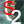

# Sentinel-2 WMS layers for QGis

This QGis plugin enables users to add WMS layers with Sentinel-2 images using the capabilites offered by Google Earth Engine.


## Prerequisites

This plugin uses the python Google Earth Engine API: `earthengine-api` python package. To use it, you need to follow these steps.

First, if you did not sign-up for Google Earth Engine, do it [here](https://earthengine.google.com/signup/)

Then install the great QGis plugin named [qgis-earthengine-plugin](https://github.com/gee-community/qgis-earthengine-plugin). You need a QGis version > 3.18. Follow the instructions to install this plugin.

If you get difficulties to install the python Earth Engine API, you can do that:

1. Open an OSGeo4W Shell
2. Type the following commands:

```bash
py3_env
pip install earthengine-api --use-feature=2020-resolver
```

Finally, create an authentication token for Google Earth Engine.

1. Open an OSGeo4W Shell
2. Type the following commands:

```bash
py3_env
python
```

You will get an interactive python console. Execute the two lines of python code:

```python
import ee
ee.Authenticate()
```

This should open a web navigator that asks you to connect to your Google account and
then asks you to accept that the Google Earth Engine Authenticator gets access to your
Google account. Once approved, you will get an authentication code that you have to
paste in the python console. 

## Install QGis plugin

The plugin can be installed as any other QGis plugins (see [link](https://docs.qgis.org/3.16/en/docs/training_manual/qgis_plugins/fetching_plugins.html))

Once installed, you get a new entry in the Web menu named "Sentinel-2 WMS layers" and an icon in the corresponding toolbar with this icon .

## Usage

To create a new WMS layer with Sentinel-2 images, click on the toolbar icon (or in the menu). You will get a dialog that enables to configure the WMS layer:
- select the images to display
- configure the rendering of images

### Select images

Google Earth Engine gives access to both the Sentinel-2 L1C (Top Of Atmosphere) and the Sentinel-2 L2A (Surface Reflectance). You have to choose one.
Then, you can filter the images having more than a given percentage of cloudy pixels. This percentage is a metadata of the Sentinel-2 images and is
computed by the ESA processing chain.

The next combobox named "Composition" lets you choose how you create the image composite of the desired collection:
- mosaic: composite overlapping images according to their order in the collection (last on top) 
- mean: compute the mean of overlapping images
- median: compute the median of overlapping images (useful to remove cloudy pixels)

More explanations [here](https://developers.google.com/earth-engine/guides/ic_composite_mosaic)

The checkbox "Filter cloudy pixels" activates a processing that masks the pixel having a cirrus or cloud bit = 1 in the QA band of the Sentinel-2 product.

The composition is created with images from the start date until the start date + duration (in days).

### Render images

The composition can be rendered three ways:
- single band (grayscale)
- 3 bands (RGB)
- compute a normalized difference between 2 bands and render it with a colormap

The widgets let you select the desired band(s) and their display range. 

## Report bugs

I'm not a QGis expert. If you find a bug in this QGis plugin, do not hesitate to create an issue [here](https://github.com/queyruto/qgis_sentinel2_geelayers/issues)

**If you like this plugin, add a star!**
